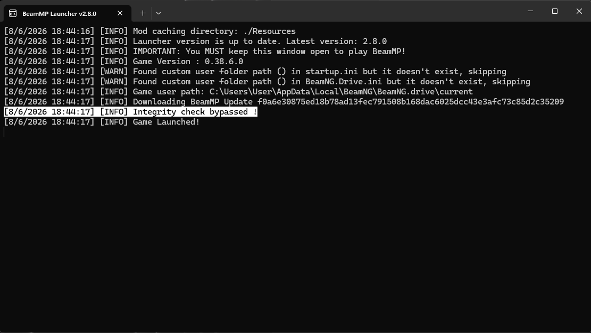
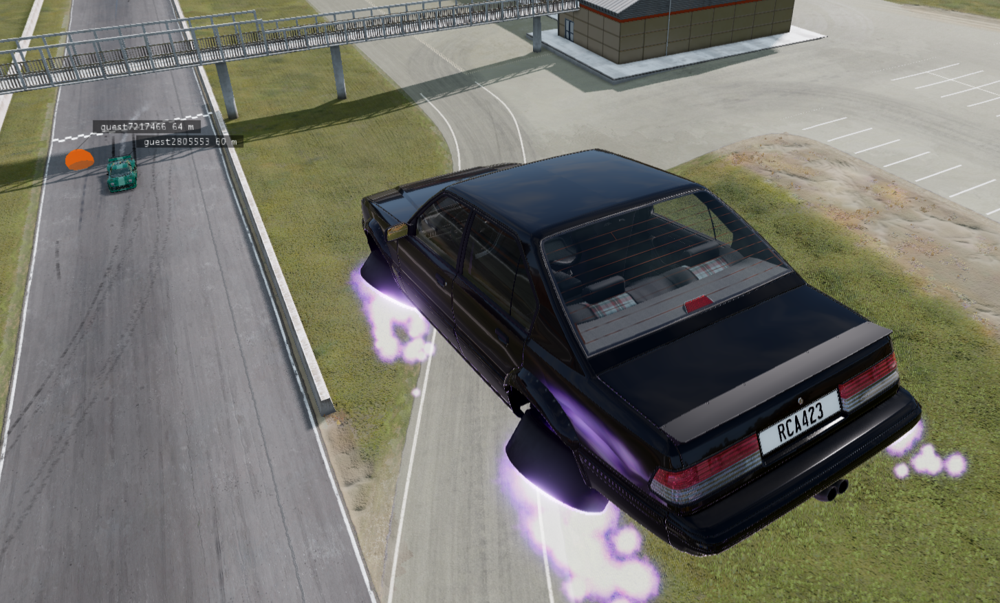

# BeamMP Mod Unlocked

An unlocked version of the BeamMP launcher and multiplayer mod that allows client-side mods to remain enabled while playing on BeamMP servers.

## Overview

By default, BeamMP performs integrity checks and disables unauthorized client-side modifications. This project modifies both the BeamMP launcher and the BeamMP multiplayer mod to bypass these restrictions.

This allows users to load and use client-side mods that would normally be disabled by BeamMP.

## Screenshots

## Official Website

https://beammp.com/

## How It Works

### Launcher Modification

The launcher normally verifies the integrity of `BeamMP.zip` and downloads a clean version if modifications are detected.

This version removes the download and replacement functionality responsible for restoring the original file, allowing modified versions of `BeamMP.zip` to remain installed.

### BeamMP Mod Modification

The `checkMod()` function inside `BeamMP.zip` has been patched so that it immediately returns without performing any validation.

As a result, client-side mods are no longer automatically disabled.

## Installation

### 1. Obtain the Files

Compile the project yourself or download:

- `BeamMP-Launcher.exe`
- Modified `BeamMP.zip`

### 2. Replace the Launcher

Replace the original BeamMP launcher executable and accompanying DLLs with the modified versions.

### 3. Replace BeamMP.zip

Navigate to your BeamMP Multiplayer folder and replace the original `BeamMP.zip` with the modified version.

### 4. Install Your Mods

Copy your desired client-side mods into the BeamNG mods folder.

Examples:

- UI modifications
- Custom scripts
- Debug tools
- Other client-side extensions

### 5. Launch and Enjoy

Start BeamMP normally and use your client-side mods.

## Important Notes

- This only affects the local client.
- Other players will **not** see your custom content unless they have the same mods installed.
- Vehicle mods, maps, assets, and other custom content may not synchronize correctly between players.
- Use at your own risk.

## Compatibility

- BeamNG.drive
- BeamMP

Compatibility may vary between BeamMP versions.

## Video Tutorial

YouTube Tutorial:

https://youtube.com/your-video-link

## Disclaimer

This project is provided for educational and research purposes only.

The author are not affiliated with BeamMP or BeamNG GmbH. Use of modified multiplayer software may violate server rules, community guidelines, or future BeamMP policies.
